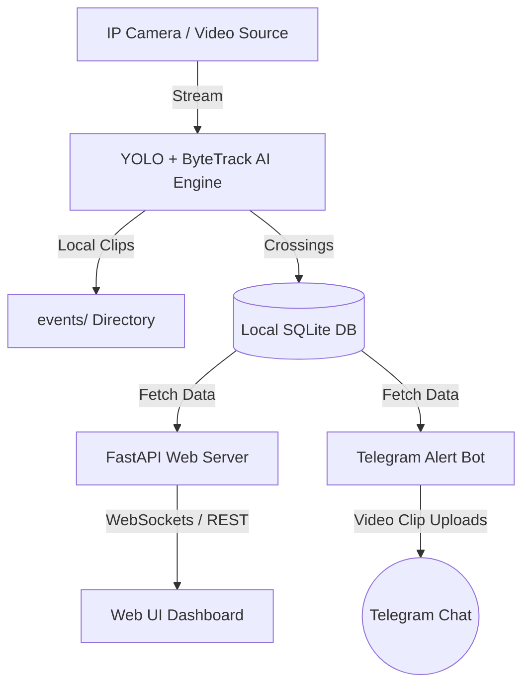

# Warehouse Gateway Car Tracking & Analytics System

An automated warehouse gateway vehicle tracking and monitoring system. The project uses YOLOv11 and ByteTrack to track, count, and record cars crossing a gateway line in real-time, displaying live data on a web dashboard and sending alert clips to Telegram.

---

## 🏗️ Project Architecture



---

## 🧠 Section 1: AI Tracking Engine (AI Model)

The core AI engine is managed by `main.py` and configuration settings. It handles object detection, tracking, line-crossing logic, video recording, and environment mode classification.

### 1. YOLOv11 Detection & Class Filtering
* **Model**: Loaded dynamically via Ultralytics YOLO framework (e.g., `yolo11m.pt` or custom models).
* **Target Class Filtering**: The tracker strictly targets **Cars** (COCO Class ID `2`). Any other objects detected are automatically ignored to ensure accurate warehouse logistics counting.
* **Hardware Acceleration**: Automatically resolves the best execution device: Apple Silicon GPU (`mps`), Nvidia CUDA (`cuda`), or standard (`cpu`).

### 2. ByteTrack Configuration (`custom_bytetrack.yaml`)
ByteTrack uses a unique two-stage association method. Instead of discarding low-confidence boxes, it matches them to prevent track fragmentation during temporary occlusions or lighting changes.

| Parameter | Value | Description |
|---|---|---|
| `tracker_type` | `bytetrack` | Selects the ByteTrack algorithm. |
| `track_high_thresh` | `0.25` | Score threshold for first association pass (high-confidence detections). |
| `track_low_thresh` | `0.10` | Score threshold for second association pass (keeps low-confidence detections for recovery). |
| `new_track_thresh` | `0.25` | Minimum confidence score to initialize a new object track. |
| `track_buffer` | `150` | Number of frames to keep a lost track in memory before deleting it (~5 seconds at 30 FPS). |
| `match_thresh` | `0.80` | Overlap matching threshold (IoU cost-based distance). |
| `fuse_score` | `True` | Fuses detection confidence scores into the IoU matching cost to prioritize high-confidence matches. |

### 3. Frame-Skipping Performance Optimization (`DETECT_EVERY`)
Running deep learning detection on every single frame of a 30 FPS stream can consume heavy GPU/CPU resources.
* **Skipping Logic**: The engine is optimized via the `DETECT_EVERY` parameter (default `10`). YOLOv11 will only execute on every 10th frame (resulting in **3 detections per second**).
* **Caching & Smooth Rendering**: During the 9 skipped frames, the tracker draws the last known bounding boxes from cache and carries over active counts. This cuts processor load by **90%** while maintaining a smooth and non-flickering visual dashboard.

### 4. Security & Night Mode
* **Time Mode Classification**: Analyzes frame brightness or schedules configured time windows to classify `DAY (Logistics Mode)` vs. `NIGHT (Security Mode)`.
* **Grayscale Processing**: Enables converting frame feeds to grayscale (`GRAYSCALE=True`) to improve YOLO model detection sensitivity and accuracy in low-light infrared cameras.

---

## 🖥️ Section 2: Backend & Infrastructure (Backend)

The backend handles the data API, real-time visualization, notification pipelines, process management, and containerized deployment.

### 1. FastAPI Web Server (`backend/app.py`)
Provides REST API endpoints and a WebSocket stream to feed the frontend dashboard:

* `GET /api/stats` — Returns today's total IN counts, OUT counts, and estimated current gateway occupancy.
* `GET /api/events` — Fetches the last $N$ vehicle crossing events with timestamp, direction, and clip paths.
* `GET /api/chart-data` — Provides hourly traffic breakdowns formatted for Chart.js.
* `WS /ws/events` — WebSocket connection for broadcasting new crossing events in real-time.
* `static /` — Serves static dashboard assets (`index.html`, `style.css`).

### 2. Web Dashboard UI (`backend/static/`)
A premium, dark-mode, fully responsive dashboard built with vanilla CSS and JavaScript:
* **Real-time Counters**: Instantly updates counters via WebSockets on new vehicle crossings.
* **Visual Graphing**: Uses Chart.js to render interactive hourly logistics traffic.
* **Event Log Feed**: Displays a running list of crossings, complete with direct links to view short recorded video clips of the crossing event.

### 3. SQLite Database (`backend/database.py`)
Persists data locally to a SQLite database. 
* **Tables**: Stores crossing event records including `track_id`, `object_type`, `direction`, `timestamp`, and the local file path to the video clip.
* **Thread-Safe**: Uses thread locks and WAL (Write-Ahead Logging) mode for robust concurrent read/write access.

### 4. Telegram Alert Bot (`backend/telegram_bot.py`)
Integrates a Telegram bot to handle security notifications and remote control:
* **Immediate Alerts**: Uploads short, annotated MP4 video clips (from $T-5$ seconds to $T+5$ seconds of crossing) directly to your Telegram chat immediately when a car crosses the gateway.
* **Daily Reports**: Auto-generates a PDF report containing traffic summaries and tables, and pushes it to the Telegram chat.
* **Interactive Commands**:
  * `/status` — View current counts, memory, and database status.
  * `/restart` — Restarts the tracking service remotely by locating and restarting the process ID saved in `.tracker.pid`.

### 5. Deployment & Process Orchestration
* **Multi-Service Script (`start_services.sh`)**: Launches the FastAPI web server, the Telegram bot polling service, and the YOLO tracking loop concurrently. It monitors process health in the background and shuts all services down cleanly upon exit.
* **Docker Support**:
  * `Dockerfile` — Builds the lightweight Python application container installing dependencies including OpenCV, PyTorch, and Ultralytics.
  * `docker-compose.yml` — Runs the system in a containerized environment, linking directories and passing environment configurations.

---

## 🚀 Quick Start Guide

### 1. Installation
Clone the repository, create a virtual environment, and install dependencies:
```bash
python3 -m venv venv
source venv/bin/activate
pip install -r requirements.txt
```

### 2. Configuration
Copy `.env.example` to `.env` and fill in your credentials:
```bash
cp .env.example .env
```
Key configuration settings to adjust in `.env`:
* `DETECT_EVERY=10` (Adjust frame skipping; `1` = no skip, `10` = run 3 times/sec at 30 FPS)
* `TRACK_BUFFER=150` (Lost object tracking memory duration in frames)
* `TELEGRAM_BOT_TOKEN` & `TELEGRAM_CHAT_ID` (For alerts and PDF reports)

### 3. Run Services
Start the tracking system, API dashboard, and Telegram bot together:
```bash
chmod +x start_services.sh
./start_services.sh
```
Open **`http://localhost:8000`** in your browser to access the dashboard.
